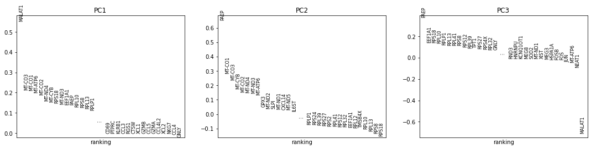

#### NewCo Endometriosis product

## Problem Summary
PLS is evaluating a company called NewCo in the endometriosis space. They are focusing on the gene A1X1. The investment team would like to know about pathogenesis, development and progression as well as important biological pathways, clinical history, etc.

## Overall Approach

### Background
My first step was to read about endometriosis in some high level sources (e.g. Wikipedia, review articles). My goal was to build familiarity with the disease and the state of research into it. I found some key takeaways:

#### Endometriosis
Endometriosis is a disease of the female reproductive system where endometrial tissue that normally grows inside the uterus grows outside the uterus (or on a part of the uterus that doesn't normally contain those cells).
- The range of symptoms is wide. Some patients experience a lot pain, other are asymptomatic
- It can cause infertility even when it doesn’t cause pain or other symptoms. Some patients are diagnosed for the first time during infertility treatment
- Endometriosis is at "the extreme end of diagnostic inefficiency" (wiki). People see 7 doctors on average before a correct diagnosis
- There were no good biomarkers as of 2016 - https://www.ncbi.nlm.nih.gov/pmc/articles/PMC6953323/
- There is no cure and treatment options are limited. Many patients are given NSAIDs

#### Molecular Causes
- There is strong evidence that endometriosis is heritable
    - Children or siblings of women with endometriosis are at higher risk of developing endometriosis themselves
    - There is an approximate six-fold increased incidence in individuals with an affected first-degree relative
- There are 9 GWAS loci of interest including 8 protein coding genes
- There are currently many proposed mechanisms, but no general agreement
    - It could be a genetic difference in the affected cells
    - Hormone producing tissue elsewhere may play a role
    - There is a possible autoimmune component. It’s loosely linked to Graves disease
    - It could be rogue stem cells (possibly from bone marrow) developing the wrong way in the wrong place

I drew a cartoon to summarize my thoughts on potentially relevant cell types. Because of the disease process, I might expect to find important genes in the endometriosis cells themselves. There may also be factors in the healthy endometrium that predispose it to form ectopically. The host tissue where the endometriosis grows may also have susceptibility factors that could be targeted.

Because there is some suspicion that autoimmunity is involved, important factors may exist in one or more immune cell types.

Healthy endometrium and endometriosis are both hormone sensitive tissues, so hormone producing tissue may play a role. This explanation seems plausible but complicated. For similar reasons, the picture doesn't include possible factors in stem cells.

Sources
- https://en.wikipedia.org/wiki/Endometriosis
- https://www.womenshealth.gov/a-z-topics/endometriosis
- https://emedicine.medscape.com/article/271899-overview
- https://www.ncbi.nlm.nih.gov/pmc/articles/PMC5737931/
- https://www.ncbi.nlm.nih.gov/pmc/articles/PMC6953323/

### Genes of Interest
I wanted to create a list of candidate genes that might be involved for downstream analysis. In a real situation, this would include A1X1 and any other genes of interest to NewCo's approach. For this exercise, I started with a list of published GWAS hits for the disease. I used these to search a database of protein functional interactions (https://string-db.org/). This found some additional genes as well as a proposed interaction network.

Gene interaction networks are challenging to construct and are often full of spurious interactions. Even the starting set only has GWAS evidence, which isn't strong on its own. Keeping those caveats in mind, I planned to use these as a starting point to guide my analysis.

Database interaction code:
- get_gene_interactions.py

### Single Cell Gene Expression
Endometriosis is an ectopic growth of one cell type in the tissue of a different cell type. This suggested to me that samples of endometriosis tissue probably contain a mixture of cell types. There may also be more than one cell type in each of the tissue types. I also expect to potentially find mobile cell types from blood.

Single Cell RNA-Sequencing gives an expression profile of a large number of cells from the sample. It might be possible to use expression to resolve cell types and find genes involved in the disease.

I would expect A1X1 to be expressed in at least one of these tissue types. Expression isn't a perfect indicator of protein level and important genes can have a large effect without being expressed, but some level of expression would support its selection as a target. Differential expression of important genes is also not guaranteed depending on the mechanism, but it is often a clue so seeing A1X1 expressed differently between cell types would also support it as a target.

#### Single Sample Analysis
A single sample likely has a mixture of cell types from the same patient. It might be possible to resolve cell types by clustering and find expression patterns just using one endometriosis sample. Some questions that could be pursued in this way are:
- What cell types are present?
- Does gene expression distinguish endometriosis tissue different from normal endometrium?
- Is there evidence that A1X1 is a good target?

#### Cross Sample Analysis
Studies that collect endometriosis samples sometimes also collect healthy samples from the same patient. These could be compared with their paired endometriosis samples after clustering. It might also be possible to label the different samples and combine them before looking for clusters.

Comparing samples across multiple patients could be done in a similar way, either by calling clusters in each sample and trying to form meta-clusters or by labeling them and clustering them together. One possible effect might be that patient-specific genetic effects would be obscured revealing more universal signals about the disease.

In general this would be a more powerful way of finding genes related to the disease using much more data. It might also get at some questions about the disease process:
- Is endometriosis a single disease process or are there subtypes in different patients?
- Which expression patterns seem consistent across patients?
- Is A1X1 a general target or is it specific to a subpopulation?

#### Cross Study Analysis
I could also do the above analysis separately across multiple data sets to see how robust any finding are. This might also reveal platform/lab specific biases.

## Datasets

#### Single Cell RNA-Seq (GEO)
There are a number of single cell RNA-Seq datasets available. Some studies focus on drug treatments or comorbidities which are probably out of scope. I looked for datasets with a straightforward study design.

- https://www.ncbi.nlm.nih.gov/geo/query/acc.cgi?acc=GSE213216
- https://www.ncbi.nlm.nih.gov/geo/query/acc.cgi?acc=GSE203191
- https://www.ncbi.nlm.nih.gov/geo/query/acc.cgi?acc=GSE179640

#### Bulk RNA-Seq of cultured cells
Bulk RNA-Seq has limited value for samples containing a mixture of cells. I found an interesting data set where RNA-Seq was done on organoids from patient cells.  It has pairs of samples from healthy endometrial tissue as well as endometriosis from the same patients. The organoids probably have expression patterns different from cells in vivo, but they can be compared to the single cell clusters to help identify them.

- https://www.ncbi.nlm.nih.gov/geo/query/acc.cgi?acc=GSE118928

## Analysis
I piloted a single sample analysis for three samples from one of the studies above. My goal was to get a sense of the data and see if the approach seemed useful. I made some very preliminary observations.

#### Data
I chose a few samples from Fonseca et. al. That study was an attempt to create a cellular atlas of multiple cell types relevant to endometriosis. They used 10X's Chromium platform to profile 54 tissue samples and processed the data with 10X's Cell Ranger software. Conveniently, the authors provided a pre-computed count matrix for each sample. I picked samples of different types for breadth, but I would want to use more individuals before making direct comparisons.

Samples
- Endometrioma (cells from a cyst caused by Endometriosis)
- Endometriosis
- Healthy Endometrium

#### Analysis
Because this is an exploratory analysis, I tried to use a simple flexible strategy. I would want something more robust and automatable for scaling.

Steps
- Normalize Data
- Run PCA
- Manually identify and remove outliers
- Look for clusters
- Identify genes that separate populations
- Look for genes in the candidate list I generated from GWAS hits

##### Normalization
I did a simple linear row normalization to make all the cells in each sample comparable.

##### PCA
Principal components analysis (PCA) is a technique for finding patterns in high dimensional data. In this case, the samples are the individual cells and the dimensions are the expression levels of each gene. PCA re-maps those dimensions into a new dimensional space. Each new dimension (PC) represents a combination of the original data. PC1 is chosen so that it explains the greatest amount of variance in the data. PC2 maximizes the remaining variation and the subsequent PCs continue this pattern.

This plot shows how much of the variance each PC explains in the endometrioma sample.

PC1 explains about 70% of the variance. The other PCs explain the remaining variance in descending order.

Plotting PC1 vs PC2 reveals some structure in the data.

I saw two distinct populations separated by PC1. To connect this to the biology, I checked to see which genes contributed most to each PC. This is the breakdown of the first three PCs.

Here, the gene HBB is the greatest contributor to PC1, followed by HBA2. MALAT1 is the top contributor to PC2. I recognized two categories of genes in these lists. There are a number of hemoglobin subunits (HB) as well as several antibody genes (IG). Both of these would be consistent with cells from blood. I didn't recognize MALAT1. It is a long non-coding RNA implicated in a few biological processes.

The next step was to experiment with removing outliers. Outliers in PCA can be important hits, but they can also mask other signals. I noticed that PC1 was dominated by a small number of extreme outliers. I this histogram, most of the data is centered a little below zero with a tight spread, but a few cells have very high values.

I removed these by setting a threshold. I also excluded the top three genes contributing to PC1: HBB, HBA1 and HBA2. The resulting PCA was dominated by outliers in PC2.

PC2 was dominated by antibody genes. I removed the outlier cells and the most highly contributing genes: IGKC, IGHG1, IGHG4 and IGHG2. This resulted in PC1 being dominated by MALAT1. Unlike the other genes I eliminated, MALAT1 expression differences aren't driven by a few outliers.

Finally I removed MALAT1 from the analysis, but did not exclude any cells.

This plot looks more normal and there seem to be patterns, but I didn't feel confident picking out clusters. I also don't have a clear biological insight about the role of MALAT1 so it's not clear what effect removing it had. I decided to look at the other samples next.

I repeated similar steps for the other two samples. The initial PCA for the endometriosis sample, without any outlier removal, revealed a similar pattern to the endometrioma sample.

I see the hemoglobin genes driving PC1 and MALAT1 driving PC. PC3 is dominated by mitochondrial genes. I would expect these to have a housekeeping role, although it's possible they are involved in disease.

The last sample I tried was healthy endometrium. This was a larger data set with 20 times as many cells. The overall shape of the data seems influenced by the difference in scale.

I notice MALAT1 driving PC1. PC2 and PC3 are both driven by the gene: PAEP. This is unusual since PCs are orthogonal, but the gene itself is interesting. The full gene name is Progestagen Associated Endometrial Protein. I was curious about this gene, so I isolated the highly expressing cells.

##### Candidate Genes
The PAEP expressing population was small, only 63 cells. I decided to look at the expression of some genes of interest in this population. These are the genes I select by expanding the list of GWAS hits through functional connections.

I looked at the differential expression between the PAEP expressing cells and the total population. I didn't attach statistical significance to these and it's premature to draw conclusions, but I do notice several genes seem to be differentially expressed. The most extreme example is the gene VEGFC a vascular growth factor.

##### Summary and Next Steps
I did some exploratory analysis on a small subset of samples from a single study. I used PCA for dimensionality reduction. This transformation seems informative about relevant genes. I wasn't able to resolve clusters, although I suspect it would be possible with more work. I inspected on interesting population of cells for differential expression of candidate genes.

I found evidence of erythrocytes in the form of hemoglobin subunit expression. The presence of these is probably just a consequence of tissue collection. The expression of IG genes suggest a population of leukocytes. These populations both seemed to be outliers. Although I excluded them from part of my analysis, the leukocytes are potentially interesting because of the possible role of autoimmunity in endometriosis.

After outlier removal, a few genes stood out.
- MALAT1 - a lncRNA. This came up as an outlier frequently
- PAEP - an endometrial protein
- VEGFC - a vascular growth factor

The next steps would be to start streamlining the process and apply it to more samples. Most of the steps are scalable, but my process for outlier removal was manual. The samples could then be used in cross sample analysis. I would also want to experiment with adding the organoid data into the PCA.

Notebook:
- sc_analysis.ipynb

## Technology Stack
One of the biggest technical challenges for this type of analysis is acquiring and storing the primary data. I was fortunate that pre-computed counts were available, but the original NGS data is many terabytes. I tested the SRA download process and I was able to get one set of reads, but it took several hours. The next step would have been to calculate the counts using Cell Ranger.

It might be useful to greedily download all potentially relevant datasets at the beginning of a project. These could be stored in low cost long term storage (e.g. AWS Glacier). Some of these may never be used. The relevant ones could be pulled into more dynamic storage like (EFS) for analysis as needed. This process could potentially use a simple automated keyword search. With some extra work it might be possible to locate the relevant files and compute the counts at this step automatically. It wouldn't need to be perfect to save time and resources. Missed datasets could always be pulled and processed manually.

Another possible area for saving space is intermediate files. The download process generates intermediate files that take up many times the space of the final download. In a distributed computing environment, these could be stored on the drive attached to the worker node running the download job. The data in these drives don't persist. It might be hard to change the size of that space, so an alternate idea would be to store them in s3.

The entire process could be automated in a Nextflow or Snakemake pipeline after some modification. This would be necessary to process a large number of samples. One step would be to decide on an automated method of outlier removal. This would be less flexible than the method I used, but it would be scalable and potentially more unbiased. I didn't get as far as computational cluster assignment in my analysis. There are a few techniques and often selecting one is a manual process, but it would be necessary to automate this step at scale. Cross-sample analysis would also be a target for automation after some pilot analysis.

